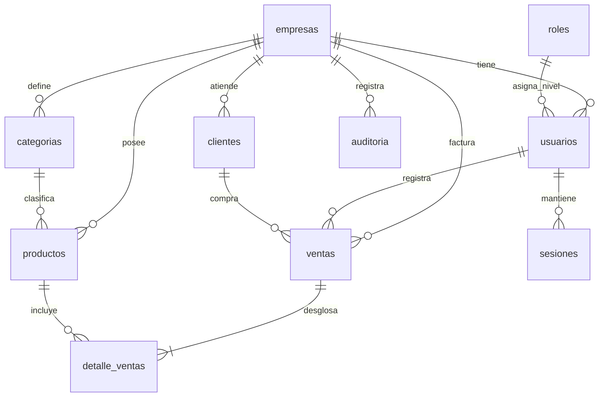
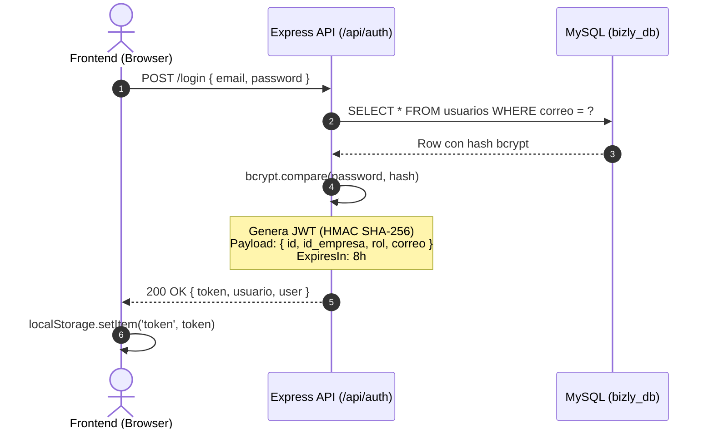
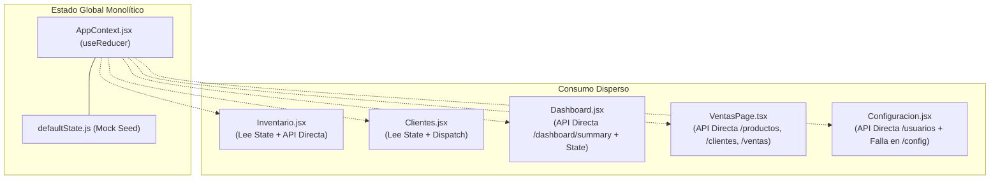

# AUDITORÍA TÉCNICA PROFUNDA Y ANÁLISIS ESTÁTICO DE ARQUITECTURA
## Proyecto: BIZLY SaaS Multi-Tenant (Estándar Enterprise)
**Fecha de Evaluación:** 18 de Septiembre de 2026  
**Rol del Evaluador:** Auditor Técnico de Software y Arquitecto de Sistemas  
**Alcance:** Escrutinio estático completo del código fuente (`Backend/`, `Frontend/`, `Database/`), seguridad, integridad transaccional, patrones de diseño y preparación para escala Enterprise.

---

## 1. Mapa de Arquitectura y Tecnologías

### 1.1. Stack Tecnológico y Versiones Reales

| Capa | Tecnología | Versión | Rol en el Sistema |
| :--- | :--- | :---: | :--- |
| **Backend Runtime** | Node.js | v20+ / CommonJS | Entorno de ejecución del servidor API |
| **Backend Framework** | Express | `5.2.1` | Enrutamiento HTTP y middleware |
| **Lenguaje Backend** | TypeScript | `5.9.3` | Tipado estático compilado con `tsc` a `dist/` |
| **Base de Datos** | MySQL | 8.0+ | Motor relacional transaccional (InnoDB) |
| **Driver de BD** | `mysql2/promise` | `3.22.5` | Pool de conexiones y ejecución de consultas SQL puras |
| **Criptografía / Auth** | `bcrypt` / `jsonwebtoken` | `6.0.0` / `9.0.3` | Hashing de credenciales y firma de tokens JWT |
| **Frontend Framework** | React | `18.3.1` | Biblioteca de interfaz de usuario |
| **Frontend Bundler** | Vite | `5.4.2` | Compilador y dev server ESM |
| **Estilos / Diseño** | Tailwind CSS + CSS plano | `3.4.19` | Sistema de clases utilitarias (`theme.enterprise`) |
| **Cliente HTTP** | Axios | `1.20.0` | Cliente HTTP con interceptores para Bearer Token |
| **Iconografía / Notif.**| `lucide-react` / `sonner` | `1.47.0` / `2.0.8` | Iconos vectoriales y sistema de notificaciones toast |
| **Gestor de Paquetes** | npm | v10+ | Gestión con `package-lock.json` en ambas capas |

---

### 1.2. Estructura Real de Carpetas y Separación de Responsabilidades

```
BIZLY/
├── .agentrules                  # Reglas del proyecto (SaaS multi-tenant, sin ORM, roles)
├── Database/
│   ├── BizlyDB.sql              # Esquema SQL relacional oficial (MySQL 8+)
│   └── README.md                # Bitácora del modelo de base de datos
├── Backend/
│   ├── src/
│   │   ├── app.ts               # Definición de Express app, middlewares base y montaje de rutas
│   │   ├── server.ts            # Punto de entrada, prueba de conexión a BD y listen
│   │   ├── config/
│   │   │   └── db.ts            # Configuración del Pool mysql2/promise (connectionLimit: 10)
│   │   ├── controllers/         # Lógica de endpoints (CRUDs, transacciones y respuesta HTTP)
│   │   │   ├── auth.controller.ts
│   │   │   ├── clientes.controller.ts
│   │   │   ├── dashboard.controller.ts
│   │   │   ├── productos.controller.ts
│   │   │   ├── usuarios.controller.ts
│   │   │   └── ventas.controller.ts
│   │   ├── middlewares/
│   │   │   └── auth.middleware.ts # Verificación de JWT (`authenticate`) y RBAC (`authorize`)
│   │   ├── routes/              # Mapeo de rutas REST protegidas
│   │   │   ├── auth.routes.ts
│   │   │   ├── clientes.routes.ts
│   │   │   ├── dashboard.routes.ts
│   │   │   ├── productos.routes.ts
│   │   │   ├── usuarios.routes.ts
│   │   │   └── ventas.routes.ts
│   │   ├── services/
│   │   │   └── email.ts         # Transporte Nodemailer para envío de códigos (desconectado)
│   │   └── types/
│   │       └── express.d.ts     # Aumento de tipos Express.Request (`req.user`)
│   └── package.json
└── Frontend/
    ├── src/
    │   ├── main.tsx             # ReactDOM.createRoot
    │   ├── App.tsx              # Shell principal, navegación manual y restauración de sesión
    │   ├── index.css            # Hoja de estilos globales y utilidades personalizadas
    │   ├── components/          # Componentes reusables (UI genérica)
    │   │   ├── Badge.jsx
    │   │   ├── BarChart.jsx
    │   │   ├── DoughnutChart.jsx
    │   │   ├── Modal.jsx
    │   │   ├── Pagination.jsx
    │   │   ├── Sidebar.jsx
    │   │   └── Toast.jsx
    │   ├── context/
    │   │   └── AppContext.jsx   # Contexto global monolítico con Reducer de estado en memoria
    │   ├── data/
    │   │   └── defaultState.js  # Estado semilla local con datos vacíos y configuración mock
    │   ├── pages/               # Vistas de la aplicación (HÍBRIDO TSX / JSX)
    │   │   ├── Auditoria.jsx          [LEGACY/DESCONECTADO]
    │   │   ├── Clientes.jsx           [HÍBRIDO CONTEXT+API]
    │   │   ├── Configuracion.jsx      [CONSUME API /usuarios, FALLA EN /configuracion]
    │   │   ├── Dashboard.jsx          [CONSUME API /dashboard/summary]
    │   │   ├── ForgotPasswordPage.tsx [ACTIVO - Paso 1 y Paso 2 recuperación]
    │   │   ├── Inventario.jsx         [CONSUME API /productos]
    │   │   ├── Login.jsx              [CÓDIGO MUERTO - No se renderiza en App.tsx]
    │   │   ├── LoginPage.tsx          [ACTIVO - Login con diseño Tailwind Enterprise]
    │   │   ├── MiCuenta.jsx           [FALLA EN ENDPOINTS INEXISTENTES]
    │   │   ├── RecuperarPassword.jsx  [CÓDIGO MUERTO - No se renderiza en App.tsx]
    │   │   ├── RegisterPage.tsx       [ACTIVO - Registro Onboarding SaaS]
    │   │   ├── Registro.jsx           [CÓDIGO MUERTO - No se renderiza en App.tsx]
    │   │   ├── Reportes.jsx           [FALLA - Endpoint backend inexistente]
    │   │   ├── Ventas.jsx             [CÓDIGO MUERTO - No se renderiza en App.tsx]
    │   │   └── VentasPage.tsx         [ACTIVO - POS completo en TypeScript]
    │   └── services/
    │       ├── api.ts           # Instancia Axios (`baseURL: /api`), interceptor Bearer Token
    │       ├── storage.js       # Utilidad de persistencia en localStorage de `bizly-state`
    │       └── utils.js         # Funciones de formateo (COP, fechas, exportación CSV)
    └── package.json
```

### 1.3. Diagnóstico de Arquitectura y Separación de Responsabilidades
1. **Disonancia Tecnológica en Frontend**: Coexisten componentes escritos en **TypeScript estricto (`.tsx`)** con componentes en **JavaScript no tipado (`.jsx`)**. Esto anula la seguridad de tipos en la mitad de las pantallas del sistema.
2. **Archivos "Fantasma" / Código Muerto**: En `Frontend/src/pages/`, existen 4 parejas de páginas duplicadas donde la versión `.jsx` es código legado abandonado (`Login.jsx`, `Registro.jsx`, `RecuperarPassword.jsx`, `Ventas.jsx`) mientras `App.tsx` utiliza las versiones `.tsx`.
3. **Ausencia de Capa de Servicios en Backend**: Los controladores en `Backend/src/controllers/` asumen simultáneamente las responsabilidades de:
   - Extracción y validación de parámetros HTTP.
   - Adquisición y liberación de conexiones del Pool.
   - Construcción directa de consultas SQL y lógica de negocio.
   - Hashing criptográfico y emisión de tokens.
   - Formateo de respuesta JSON.
   No existe una capa `Service` ni un patrón `Repository`, violando el principio de responsabilidad única.

---

## 2. Modelado de Datos y SQL

### 2.1. Análisis del Esquema Relacional (`Database/BizlyDB.sql`)

El esquema cuenta con 11 tablas principales:
`empresas`, `roles`, `usuarios`, `sesiones`, `tokens_verificacion`, `tokens_recuperacion`, `categorias`, `productos`, `clientes`, `ventas`, `detalle_ventas`, `auditoria`.



### 2.2. Evaluación de Claves Foráneas e Integridad Referencial

| Relación | Acción ON DELETE | Evaluación Técnica | Riesgo Enterprise |
| :--- | :---: | :--- | :--- |
| `usuarios -> empresas` | `CASCADE` | Si se elimina la empresa, se borran todos sus usuarios. | Esperable en desmantelamiento total de tenant. |
| `productos -> empresas` | `CASCADE` | Borra catálogo completo si se borra la empresa. | Esperable en purga total. |
| `ventas -> empresas` | `CASCADE` | Borra histórico contable/fiscal del tenant. | **ALTO RIESGO**: Violación de trazabilidad fiscal/auditoría. Requiere Soft Delete en `empresas`. |
| `detalle_ventas -> ventas` | `CASCADE` | Borra líneas de ítem si la cabecera es eliminada. | Coherente a nivel de agregación relacional. |
| `detalle_ventas -> productos` | `RESTRICT` (Default) | No permite borrar físicamente un producto si ya tiene ventas. | **Excelente**: Obliga al uso de borrado lógico (`estado = 'Inactivo'`). |
| `ventas -> clientes` | `SET NULL` | Si un cliente se elimina, `id_cliente` en la venta pasa a `NULL`. | Protege el registro de venta, pero pierde la referencia al histórico si no se desnormalizó. |

### 2.3. Grietas de Aislamiento y Estrategia Multi-Tenancy

El modelo adoptado corresponde al patrón **"Shared Database, Shared Schema, Discriminator Column (`id_empresa`)"** (Base de datos y esquema compartidos con columna discriminadora).

#### Hallazgos Críticos en Multi-Tenancy:
1. **Ruptura de Aislamiento en `usuarios.correo`**:
   - Definición SQL: `CONSTRAINT uq_usuarios_correo UNIQUE (correo)`.
   - **Falla Arquitectónica**: El correo es único a nivel GLOBAL de la base de datos, en lugar de ser compuesto `UNIQUE (id_empresa, correo)`.
   - **Impacto**: Un colaborador con correo corporativo (ej. `contador@consultora.com`) no puede prestar servicios a dos empresas en la plataforma. Si una empresa registra `admin@tienda.com`, ningún otro tenant del sistema puede registrar ese correo.
2. **`detalle_ventas` carece de Discriminador de Tenant (`id_empresa`)**:
   - La tabla `detalle_ventas` contiene: `id_detalle`, `id_venta`, `id_producto`, `cantidad`, `precio_unitario`, `subtotal`.
   - **Falla**: No tiene la columna `id_empresa`. Si se realiza una consulta directa a `detalle_ventas` sin realizar un `INNER JOIN ventas v ON v.id_venta = dv.id_venta AND v.id_empresa = ?`, se genera un riesgo inminente de fuga de datos entre empresas vecinas.
3. **Ausencia de Consecutivo de Facturación por Tenant**:
   - `ventas` depende exclusivamente de `id_venta INT AUTO_INCREMENT PRIMARY KEY`.
   - **Riesgo Enterprise**: 
     * Las empresas ven números de venta globales y discontinuos (ej. Venta #12, luego Venta #450 porque otros tenants vendieron en el intervalo).
     * Permite inferir el volumen global de negocio de la competencia (Business Intelligence Leakage).
     * Incumple los requisitos de facturación fiscal (resolución de numeración consecutiva continua por empresa).
4. **Strings Vacíos en Restricciones de Unicidad**:
   - `productos`: `CONSTRAINT uq_productos_sku_empresa UNIQUE (id_empresa, sku)` donde `sku VARCHAR(50) NULL`.
   - `clientes`: `CONSTRAINT uq_clientes_documento_empresa UNIQUE (id_empresa, tipo_doc, documento)` donde `documento VARCHAR(20) NULL`.
   - En MySQL, múltiples valores `NULL` no violan un índice `UNIQUE`. Sin embargo, si el frontend o backend envía un string vacío `""` en lugar de `NULL`, el segundo registro sin SKU o sin documento fallará con error fatal `ER_DUP_ENTRY`.

---

## 3. Flujo de Autenticación y Autorización

### 3.1. Generación del JWT y Ciclo de Vida



#### Vulnerabilidades y Defectos en Auth:
1. **Fallback a Secreto Inseguro**:
   En `auth.controller.ts` (líneas 77 y 150):
   `const secret = process.env.JWT_SECRET || 'secret';`
   Si el archivo `.env` no define la variable o se despliega sin ella en un contenedor, el sistema firma tokens con el secreto trivial `'secret'`, permitiendo la falsificación de tokens a cualquier atacante.
2. **Inexistencia de Refresh Tokens**:
   El token tiene una expiración fija de 8 horas. No existe rotación de tokens (`refresh token` implementado en backend), lo que obliga al usuario a sufrir una desautenticación abrupta a las 8 horas o a mantener una ventana de exposición muy larga si el token es robado.
3. **Desconexión Total de la Tabla `sesiones`**:
   `BizlyDB.sql` define una tabla `sesiones` con `token_hash`, `fecha_expiracion` y `revocado`. **El backend NUNCA escribe en ella ni la consulta**. El endpoint `logout` (`POST /api/auth/logout`) es una cáscara vacía:
   ```ts
   // Backend/src/controllers/auth.controller.ts:285
   export const logout = async (_req: Request, res: Response): Promise<void> => {
     res.status(200).json({ message: 'Sesión cerrada exitosamente' });
   };
   ```
   Un token robado o descartado continúa siendo válido durante las 8 horas completas aunque el usuario haga click en "Cerrar sesión".

### 3.2. Almacenamiento en Cliente y Riesgo XSS / CSRF
- **Almacenamiento**: El token se guarda en el `localStorage` del navegador (`localStorage.getItem('token')`).
- **Evaluación frente a XSS**: **CRÍTICA**. Cualquier script inyectado mediante vulnerabilidades XSS en componentes de terceros o inputs no escapados tiene acceso irrestricto al token JWT y puede exfiltrarlo hacia servidores externos.
- **Evaluación frente a CSRF**: Al no usarse cookies automáticas para el transporte de credenciales (sino el header `Authorization: Bearer <token>`), los ataques CSRF clásicos quedan neutralizados. No obstante, esto es a expensas de quedar completamente expuesto a XSS.
- **Recomendación Enterprise**: Migrar a cookies `HttpOnly`, `Secure`, `SameSite=Strict` o implementar un esquema con BFF (Backend-for-Frontend) y tokens efímeros en memoria.

### 3.3. Control de Acceso por Roles (RBAC) y Aislamiento en Middleware

```ts
// Backend/src/middlewares/auth.middleware.ts
export const authenticate = (req: Request, res: Response, next: NextFunction): void => { ... };
export const authorize = (...rolesPermitidos: string[]) => { ... };
```

- **Inspección sin Base de Datos**: `authenticate` solo verifica la firma criptográfica del JWT con `jwt.verify`. No realiza ninguna consulta a la base de datos para verificar si:
  * El usuario fue dado de baja (`estado = 'Inactivo'`).
  * La empresa fue suspendida por falta de pago (`estado = 'Suspendido'`).
  * El rol del usuario fue degradado en el ínterin.
- **Protección de Rutas en Frontend**:
  En `Frontend/src/App.tsx`, el enrutamiento es una SPA casera controlada por estado local (`useState('dashboard')`):
  ```tsx
  const ADMIN_ONLY_PAGES = ['auditoria', 'configuracion'];
  const esAdmin = ['admin', 'administrador', 'owner'].includes(usuario?.rol || '');
  const pageSegura = ADMIN_ONLY_PAGES.includes(activePage) && !esAdmin ? 'dashboard' : activePage;
  ```
  Esto previene visualmente el acceso a pantallas administrativas en la UI, respaldado adecuadamente por el middleware `authorize('owner', 'administrador')` en los endpoints de backend.

---

## 4. Análisis de Endpoints y API

### 4.1. Inventario y Mapeo de Endpoints REST

| Módulo | Método | Ruta | Middleware / Protección | Estado en Backend |
| :--- | :---: | :--- | :--- | :---: |
| **Auth** | POST | `/api/auth/register` | Público | Operativo (Transaccional) |
| **Auth** | POST | `/api/auth/login` | Público | Operativo (bcrypt compare) |
| **Auth** | POST | `/api/auth/forgot-password` | Público | **Simulado / Modo Demo** |
| **Auth** | POST | `/api/auth/recuperar` | Público | **Simulado / Modo Demo** |
| **Auth** | POST | `/api/auth/reset-password` | Público | **VULNERABLE (Sin verificación)** |
| **Auth** | GET | `/api/auth/me` | `authenticate` | Operativo |
| **Auth** | POST | `/api/auth/logout` | Público | Dummy (No invalida token) |
| **Ventas** | POST | `/api/ventas` | `authenticate` | Operativo (FOR UPDATE) |
| **Ventas** | GET | `/api/ventas` | `authenticate` | Operativo (**Sin paginación**) |
| **Ventas** | PUT | `/api/ventas/:id/anular` | `authenticate`, `authorize(admin)` | Operativo (Transaccional) |
| **Productos** | GET | `/api/productos` | `authenticate` | Operativo (**Sin paginación**) |
| **Productos** | POST | `/api/productos` | `authenticate` | Operativo |
| **Productos** | PUT | `/api/productos/:id` | `authenticate` | Operativo |
| **Productos** | DELETE | `/api/productos/:id` | `authenticate`, `authorize(admin)` | Operativo (Soft Delete) |
| **Productos** | POST | `/api/productos/importar` | `authenticate`, `authorize(admin)` | Operativo (Límite 500) |
| **Clientes** | GET | `/api/clientes` | `authenticate` | Operativo (**Sin paginación**) |
| **Clientes** | POST | `/api/clientes` | `authenticate` | Operativo (Unicidad doc) |
| **Clientes** | PUT | `/api/clientes/:id` | `authenticate` | Operativo |
| **Clientes** | DELETE | `/api/clientes/:id` | `authenticate` | Operativo (Soft Delete) |
| **Usuarios** | GET | `/api/usuarios` | `authenticate`, `authorize(admin)` | Operativo |
| **Usuarios** | POST | `/api/usuarios` | `authenticate`, `authorize(admin)` | Operativo (bcrypt hash) |
| **Usuarios** | PUT | `/api/usuarios/:id` | `authenticate`, `authorize(admin)` | Operativo |
| **Dashboard** | GET | `/api/dashboard/summary` | `authenticate` | Operativo (Agregación SQL) |
| **Config** | * | `/api/configuracion` | — | **INEXISTENTE EN BACKEND (404)** |
| **Auditoría** | * | `/api/auditoria` | — | **INEXISTENTE EN BACKEND (404)** |
| **Reportes** | * | `/api/reportes/*` | — | **INEXISTENTE EN BACKEND (404)** |

### 4.2. Manejo Global de Errores
- **Diagnóstico**: **NO EXISTE un manejador centralizado de errores**.
- En `Backend/src/app.ts`, no hay declarada ninguna función con la firma `(err: Error, req: Request, res: Response, next: NextFunction)`.
- Cada controlador implementa bloques `try / catch` repetitivos donde se ejecuta `console.error` y se devuelve `res.status(500).json({ error: '...' })`.
- Si una promesa es rechazada fuera de un try/catch o un middleware asíncrono lanza un error no interceptado, Express (v5) manejará el error con su página HTML por defecto o la conexión quedará colgada.

### 4.3. Validación de Entradas (Inputs)
- **Diagnóstico**: **Artesanal y precaria**. No se utiliza ningún esquema declarativo de validación como Zod, Joi o Yup.
- Se realizan comprobaciones simples con `if (!nombre)` o `isNaN(Number(precio))`.
- Campos como correos no se validan contra expresiones regulares en backend (`auth.controller.ts` acepta cualquier string en el login/registro siempre que no esté vacío).
- No hay desinfección contra strings maliciosos o payloads con propiedades inesperadas (Mass Assignment vulnerability).

### 4.4. Paginación en Base de Datos
- **Diagnóstico**: **COMPLETAMENTE AUSENTE EN EL BACKEND**.
- Endpoints de alto volumen como `GET /api/ventas`, `GET /api/productos` y `GET /api/clientes` realizan un `SELECT * FROM tabla WHERE id_empresa = ?` sin cláusulas `LIMIT` ni `OFFSET`.
- En una empresa con 10,000 transacciones o 5,000 productos, el backend cargará miles de registros a la memoria RAM de Node.js, serializará megabytes de JSON y saturará la red.
- El Frontend "oculta" este problema ejecutando paginación cosmética en memoria en el navegador con `slice((page - 1) * PAGE_SIZE, page * PAGE_SIZE)`.

---

## 5. Frontend y Gestión de Estado

### 5.1. Arquitectura de Estado y Flujo de Datos



#### Patologías Encontradas en el Frontend:
1. **Doble Fuente de la Verdad (Dual State Architecture)**:
   - `AppContext.jsx` mantiene un estado global precargado en el arranque (`state.productos`, `state.clientes`, `state.ventas`).
   - Simultáneamente, pantallas como `VentasPage.tsx`, `Dashboard.jsx` y `Configuracion.jsx` realizan peticiones HTTP independientes con `api.get()` y mantienen su propio `useState` local.
   - **Consecuencia**: Pérdida de sincronización. Si se crea un producto en `Inventario.jsx`, no siempre se refleja inmediatamente en `VentasPage.tsx` a menos que se fuerce una recarga completa de la ventana.
2. **Acoplamiento Extremo y Re-renderizados Innecesarios**:
   - Todo el estado reside en un único contexto (`AppContext`). Cualquier despacho que modifique `config`, muestre una notificación (`notify`) o altere una lista genera el re-renderizado en cascada de todos los componentes suscritos a `useApp()`.
3. **Ausencia de un Router Declarativo (React Router)**:
   - En lugar de `react-router-dom`, `App.tsx` utiliza una variable de estado:
     `const [pantalla, setPantalla] = useState('login')`
     `const [activePage, setActivePage] = useState('dashboard')`
   - **Impacto**:
     * No hay soporte para botón "Atrás" o "Adelante" del navegador.
     * No hay deep linking (imposible enviar una URL directa como `/ventas` o `/inventario`).
     * Si el usuario presiona F5 para refrescar la página, pierde el contexto de navegación y regresa siempre a `dashboard`.
4. **Falta de Librería Especializada de Data Fetching**:
   - No se utiliza TanStack Query (React Query) ni SWR.
   - Todo el manejo de loading, error, cancelación de peticiones con `AbortController` y caché se hace de manera manual, proclive a fugas de memoria y condiciones de carrera (*race conditions* en `useEffect`).

---

## 6. Deuda Técnica y Vulnerabilidades (CRÍTICO)

### 6.1. Vulnerabilidades de Seguridad Graves

#### A. Bypass Crítico en Restablecimiento de Contraseña (Account Takeover)
- **Archivo**: `Backend/src/controllers/auth.controller.ts`, líneas 210–243 (`resetPassword`).
- **Código Real**:
  ```ts
  export const resetPassword = async (req: Request, res: Response): Promise<void> => {
    const { email, correo, password, nuevaPassword } = req.body;
    const userEmail = (email || correo || '').trim();
    const nextPassword = password || nuevaPassword;
    ...
    const hashedPassword = await bcrypt.hash(nextPassword, 10);
    const [result] = await pool.query<ResultSetHeader>(
      'UPDATE usuarios SET password = ? WHERE correo = ?',
      [hashedPassword, userEmail]
    );
  ```
- **Severidad**: **CRÍTICA (CVSS 9.8)**.
- **Explicación**: El endpoint no solicita ni valida ningún token de recuperación, código OTP o verificación previa. Cualquier usuario no autenticado que conozca el correo de la víctima puede enviar una petición POST a `/api/auth/reset-password` y cambiar de inmediato la contraseña de cualquier cuenta (incluyendo la del Propietario/Owner).

#### B. Exposición de Código de Verificación en Respuesta HTTP (Demo Mode Leak)
- **Archivo**: `Backend/src/controllers/auth.controller.ts`, líneas 202–207 (`forgotPassword`).
- **Código Real**:
  ```ts
  // Respuesta simulada en modo demo para recuperación de contraseña
  res.status(200).json({
    mensaje: 'Código de recuperación enviado al correo (modo demo)',
    message: 'Código de recuperación enviado al correo (modo demo)',
    devCode: '123456',
  });
  ```
- **Severidad**: **ALTA**.
- **Explicación**: La clave de recuperación está hardcodeada (`'123456'`) y se retorna directamente al cliente en el cuerpo de la respuesta HTTP, sin enviar ningún correo electrónico ni registrar el token en la tabla `tokens_recuperacion`.

#### C. Omisión de Columnas Contables en Registro de Ventas
- **Archivo**: `Backend/src/controllers/ventas.controller.ts`, líneas 118–122 (`createVenta`).
- **Código Real**:
  ```ts
  const [ventaResult] = await connection.query<ResultSetHeader>(
    `INSERT INTO ventas (id_empresa, id_usuario, id_cliente, total, metodo_pago, estado)
     VALUES (?, ?, ?, ?, ?, ?)`,
    [id_empresa, id_usuario, cliente_id, totalCalculado, forma_pago, 'Completada']
  );
  ```
- **Severidad**: **MEDIA / CONTABLE**.
- **Explicación**: La tabla `ventas` tiene definidas las columnas `subtotal` e `impuesto`. El `INSERT` las omite por completo, haciendo que en base de datos queden guardadas en `0.00`. Se pierde la trazabilidad fiscal del IVA cobrado en cada venta.

#### D. CORS Completamente Permisivo
- **Archivo**: `Backend/src/app.ts`, línea 12.
- **Código Real**: `app.use(cors());`
- **Explicación**: Habilita `Access-Control-Allow-Origin: *` sin restricción de dominio, permitiendo que cualquier sitio web malicioso realice llamadas cross-origin a la API.

---

### 6.2. Violaciones de Principios SOLID

| Principio | Violación Concreta en el Código |
| :--- | :--- |
| **S (Single Responsibility)** | `VentasPage.tsx` (634 líneas) maneja renderizado UI, estado de carrito, filtrado por cliente, debounce de búsqueda, cálculo de impuestos, alertas Sonner y peticiones Axios directamente.<br>`ventas.controller.ts` maneja deserialización HTTP, lógica de bloqueo de stock, cálculos monetarios, actualización de saldos de clientes y emisión de respuestas. |
| **O (Open/Closed)** | Si se requiere agregar un nuevo método de pago o tipo de comprobante, se deben modificar sentencias `INSERT` SQL estáticas y condicionales hardcodeados en lugar de utilizar una interfaz o estrategia polimórfica. |
| **L (Liskov Substitution)** | No aplica directamente por ausencia de clases de dominio o jerarquías polimórficas (código procedural estructurado en funciones). |
| **I (Interface Segregation)** | En frontend, el contrato de `useApp()` expone más de 15 métodos y 5 estados masivos en un único objeto, obligando a componentes pequeños a suscribirse a toda la maquinaria del sistema. |
| **D (Dependency Inversion)** | Todos los controladores importan directamente la instancia concreta del pool `pool` desde `../config/db`. No existen contratos/interfaces de repositorios ni inversión de control, imposibilitando la ejecución de pruebas unitarias con mocks de base de datos. |

---

### 6.3. Atomicidad Transaccional y Concurrencia

| Operación | Transaccionalidad | Bloqueo Concurrencia | Evaluación |
| :--- | :---: | :---: | :--- |
| **Registro SaaS (`register`)** | `connection.beginTransaction()` | No requerido (verificación email) | **Sólido**. Garantiza que si falla la creación del usuario se revierte la empresa. |
| **Creación de Venta (`createVenta`)** | `connection.beginTransaction()` | `SELECT ... FOR UPDATE` | **Sólido**. Bloquea filas de producto para evitar carreras de sobreventa (*overselling*). |
| **Anulación de Venta (`anularVenta`)** | `connection.beginTransaction()` | `SELECT ... FOR UPDATE` en venta | **Sólido**. Reversión atómica de stock y métricas del cliente. |
| **Importación CSV (`importarProductos`)** | `connection.beginTransaction()` | No aplica (Límite 500) | **Sólido**. Si un ítem del lote tiene error, revierte todo el lote. |
| **Creación de Producto (`createProducto`)** | **SIN TRANSACCIÓN** | Inexistente | **DEFICIENTE**. Inserta primero en `categorias` y luego en `productos` con conexiones independientes del pool. Si la inserción del producto falla, la categoría queda huérfana. |
| **Creación de Usuario (`createUsuarioEmpresa`)** | **SIN TRANSACCIÓN** | Inexistente | **ACEPTABLE**, operación de una sola tabla. |

---

## 7. Veredicto de Componentes

La siguiente matriz clasifica de forma implacable el estado de madurez de cada módulo para determinar el plan de acción requerido de cara al estándar SaaS Enterprise.

| Módulo / Dominio | Estado Actual en Código | Veredicto Técnico | Justificación del Veredicto |
| :--- | :--- | :---: | :--- |
| **Autenticación & Sesión** | Login, registro y `/me` operativos con bcrypt y JWT. Endpoint de recuperación con bypass crítico (`resetPassword` sin código, `devCode` mock en respuesta). Logout no revoca tokens. Falta tabla `sesiones` activa. | **Refactorización Mayor** | La lógica de hashing y onboarding es correcta, pero el bypass de restablecimiento de contraseña representa una vulnerabilidad de seguridad inaceptable para un SaaS comercial. |
| **Ventas & Facturación (POS)** | Lógica transaccional atómica con `SELECT ... FOR UPDATE`, resta de stock y reversión en anulación. Omite `subtotal` e `impuesto` en el INSERT. No tiene consecutivo fiscal ni paginación en backend. Componente UI monolítico de 634 líneas. | **Refactorización Menor** | El núcleo transaccional en backend es de alta calidad y previene sobreventa. Solo requiere corregir las columnas de impuestos, agregar paginación `LIMIT/OFFSET` y modularizar el componente UI. |
| **Inventario & Productos** | CRUD funcional con soft-delete. Creación dinámica de categorías. Importación masiva CSV transaccional de hasta 500 filas. Falta paginación en backend y transaccionalidad en `createProducto`. | **Refactorización Menor** | Módulo robusto con validaciones numéricas sólidas. Requiere paginación en servidor y eliminar llamadas a la BD sin transacción al crear categorías al vuelo. |
| **Clientes** | CRUD completo con soft-delete. Verificación rigurosa de documento único por tenant (`tipo_doc, documento, id_empresa`). Falta paginación en backend y regex estricto de email. | **Refactorización Menor** | Código limpio y bien aislado por `id_empresa`. Solo requiere incorporar paginación en backend y validación de entrada tipada. |
| **Dashboard Ejecutivo** | Endpoint `GET /api/dashboard/summary` con agregaciones SQL nativas eficientes (`SUM`, `COUNT`, filtrado por fecha actual y mes). Gráficos de productos top y ventas históricas en frontend dependen de datos que el backend no retorna (`v.items` ausente en `getVentas`). | **Refactorización Mayor** | Las tarjetas KPI son sólidas y de respuesta inmediata, pero la sección analítica de gráficos está rota o desincronizada debido a que el backend no expone endpoints para series de tiempo ni ranking de productos. |
| **Configuración del Tenant** | Pestaña de usuarios operativa vía `/api/usuarios`. Pestaña "Mi Empresa" intenta consumir `PUT /api/configuracion`, el cual **no existe en el backend** (devuelve 404). Los datos fiscales y de umbral de stock no se persisten. | **Reescribir desde Cero** | El backend no posee rutas ni controladores de configuración de empresa (`/api/configuracion`). La persistencia está completamente rota en la interfaz. |
| **Centro de Auditoría** | La tabla `auditoria` existe en MySQL pero **ningún endpoint del backend escribe en ella** ni existe `/api/auditoria`. La vista `Auditoria.jsx` consume un array mock vacío. | **Reescribir desde Cero** | Inexistencia absoluta de middleware o servicio de registro de logs de auditoría en backend. El frontend es puramente decorativo. |
| **Módulo de Reportes** | Vista `Reportes.jsx` intenta invocar `GET /api/reportes/resumen`, el cual **no existe en el backend** (devuelve 404). | **Reescribir desde Cero** | No existe ningún controlador, ruta ni servicio de generación de reportes en el backend. |

---

## 8. Hoja de Ruta Recomendada para Estándar Enterprise

1. **Inmediato (Seguridad Crítica)**:
   - Reparar la brecha de `resetPassword` implementando validación estricta de OTP contra la tabla `tokens_recuperacion`.
   - Conectar el servicio `Backend/src/services/email.ts` para despachar códigos reales por SMTP.
   - Forzar validación de secreto JWT (`process.env.JWT_SECRET`) sin fallback a `'secret'`.
   - Configurar CORS con lista blanca de orígenes y cabeceras de seguridad con Helmet.
2. **Corto Plazo (Integridad y Completitud de API)**:
   - Implementar endpoints faltantes: `/api/configuracion` (GET / PUT para la empresa del tenant), `/api/reportes` y middleware interceptor de `/api/auditoria`.
   - Implementar paginación obligatoria por cursor o `limit/offset` en `/api/ventas`, `/api/productos` y `/api/clientes`.
   - Registrar `subtotal` e `impuesto` en el `INSERT INTO ventas`.
3. **Mediano Plazo (Frontend y Arquitectura)**:
   - Eliminar los archivos legados `.jsx` huérfanos (`Login.jsx`, `Registro.jsx`, `RecuperarPassword.jsx`, `Ventas.jsx`).
   - Reemplazar el enrutador manual en `App.tsx` por `react-router-dom` con deep linking y guards de sesión.
   - Reemplazar el monolito `AppContext.jsx` por TanStack Query (React Query) para gestión asíncrona de servidor y Zustand para estado puramente de UI (carrito de ventas y filtros).
